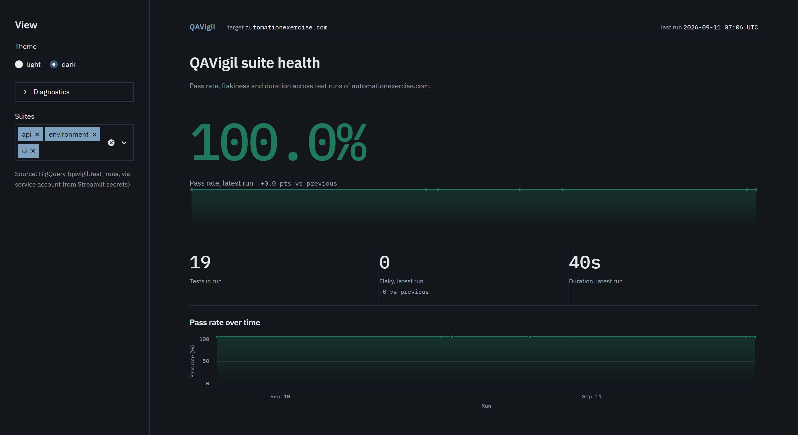
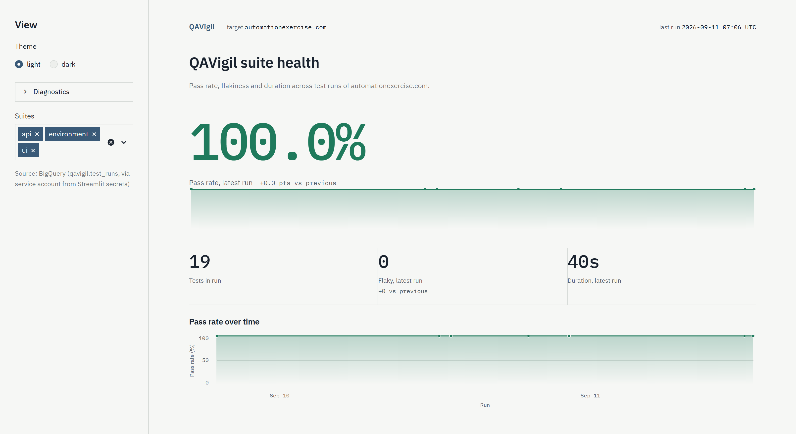

# QAVigil

A CI-gated UI and API test suite for a live e-commerce application, with a
test-analytics dashboard built on its own run history.

[](https://github.com/l1kshay/QAVigil/actions/workflows/tests.yml)
[](https://www.python.org/downloads/)
[](LICENSE)

**Live dashboard:** https://appvigil-beqhzc3u7ebjddzqbkmgcx.streamlit.app

Reading real run history out of BigQuery, written by this repository's own CI.



<details>
<summary>Same dashboard, light theme</summary>



</details>

---

## What this is

A portfolio project demonstrating QA/SDET engineering practice end to end:
strict Page Object Model for the browser layer, a client layer for the API,
externalized test data, CI that gates on every push, and an analytics layer
that turns run history into a picture of suite health over time.

The application under test is
[automationexercise.com](https://automationexercise.com) — a public demo store
with both a real UI and a documented REST API. QAVigil does not build or host
that application. It tests it.

Three things it does:

- **UI automation** — Playwright driving four end-to-end user journeys through
  page objects. No test file contains a raw locator or a URL.
- **API testing** — a client layer over the six documented endpoints, with
  JSON Schema validation of every response contract. No test file calls
  `requests` directly.
- **Run analytics** — each CI run appends one row per test to BigQuery; the
  Streamlit dashboard above reads that history for pass-rate trend, flaky-test
  frequency and suite duration.

## What it covers

**70 test cases, from 52 test functions.** The difference is parametrization:
thirteen functions expand into multiple cases from the YAML and JSON fixtures
in `test_data/`. Both numbers are worth stating — 70 is what pytest collects
and what CI gates on; 52 is how many distinct test bodies exist.

| | Test functions | Collected cases |
|---|---|---|
| `tests/ui/` | 21 | 25 |
| `tests/api/` | 28 | 42 |
| `tests/test_environment.py` | 3 | 3 |
| **Total** | **52** | **70** |

Four distinct end-to-end UI flows, identified by what each test actually
drives rather than by filename:

1. **Authentication** — sign in, invalid credentials, sign out
2. **Product browse and search** — catalogue, search, empty results
3. **Cart** — add from listing, quantity, removal, anonymous-checkout block
4. **Checkout and payment** — address review, order placement, invoice

The environment checks are separate on purpose. When a run goes red, they are
what distinguishes "the suite found a regression" from "the target site was
unreachable".

Every test is independent and order-agnostic, which is what makes parallel
execution safe: the full suite runs in roughly 58 seconds across four workers,
against about two and a half minutes serially.

## Continuous integration

| Trigger | What runs |
|---|---|
| Push to `main` | `smoke` — 19 cases, fast feedback |
| Pull request | `regression` — 51 cases |
| Nightly, 03:00 UTC | `regression` — the target is a third-party site that can break without anyone touching this repo |
| Manual dispatch | Your choice of `smoke`, `regression` or everything |

A failing test fails the check. Reports publish either way, because the report
of a failing run is the one worth reading. UI failures attach a screenshot,
the URL, the page HTML and a full Playwright trace, openable at
[trace.playwright.dev](https://trace.playwright.dev) — which is what makes a
CI-only failure diagnosable.

CI reruns a failing test once. A test that fails and then passes is flaky by
definition; one that fails twice is a real failure. That distinction is what
keeps a red build meaningful.

## Four defects found in the tests themselves

The most useful thing this project produced was not a bug in the application.
It was four defects in the test suite's own logic — three of which were
passing, or would have passed, while testing nothing. They are listed here
because catching them is the actual skill.

**A vacuous assertion pattern that would have disabled every negative test.**
The target API answers *every* request with `HTTP 200` and reports the real
outcome in a `responseCode` field in the body. A missing parameter returns
`HTTP 200` with `{"responseCode": 400}`. A suite asserting on
`response.status_code` would have seen 200 everywhere, and all eighteen
negative cases would have passed without exercising anything. The client layer
resolves status from the body, and one test asserts that premise explicitly so
it cannot rot unnoticed.

**A false assumption about how search works.** A UI test required every search
result's name to contain the search term. It failed — correctly. The site
matches on product *category* as well as name, so searching "dress" returns
items whose names lack the word. The test had encoded a belief about the
feature that was simply wrong. It now asserts a true property, and category
relevance moved to the API suite, where the field actually exists.

**A flaky test, root-caused rather than retried.** A checkout test timed out
under four-way parallelism. The cause was not the site being slow: the wait
was on the navigation's `load` event, which also waits on every subresource,
and the page embeds third-party ad frames that outlast the timeout. The
navigation had already succeeded. Waiting for `commit`, and for the element
the next step needs, turned one flaky failure into three consecutive clean
runs — and made the suite 25% faster. No retry, no `sleep()`.

**A security test blocked before it reached the server.** The SQL-injection
case used `' OR '1'='1`, which contains spaces and is therefore not a valid
email address. The browser's native validation refused to submit the form, so
the payload never reached the application. The test passed, and proved only
that browsers validate email syntax. The payload is now formatted to actually
reach the server, and the client-side blocking it had been accidentally
exercising is covered by its own test.

None of these were bugs in automationexercise.com. The site behaved as
documented throughout.

## Tech stack

| Layer | Tools |
|---|---|
| Browser automation | Playwright |
| API | requests, jsonschema |
| Test framework | pytest, pytest-xdist, pytest-rerunfailures |
| Test data | PyYAML, Faker |
| Reporting | Allure, pytest-html |
| Configuration | python-dotenv |
| CI and hosting | GitHub Actions, GitHub Pages |
| Analytics | BigQuery, Streamlit, Altair, pandas |

## Running it locally

Python 3.11 or newer; developed and pinned against 3.12.

```bash
git clone https://github.com/l1kshay/QAVigil.git
cd QAVigil

python -m venv .venv
source .venv/bin/activate          # Windows: .venv\Scripts\activate

pip install -r requirements.txt
python -m playwright install chromium

pytest                             # everything, 70 cases
pytest -m smoke                    # 19 cases
pytest -n 4                        # four workers in parallel
```

No configuration is required. Every setting has a working default, and tests
that need a signed-in user create a throwaway account through the site's API
and delete it afterwards — so a fresh clone runs green with no credentials.
Copy `.env.example` to `.env` only to change the target, switch browser, or
watch a run headed:

```bash
HEADLESS=false SLOW_MO_MS=300 pytest -m smoke -k checkout
```

## Analytics

The dashboard source is in [`analytics/`](analytics/). After each CI run,
[`export_to_bigquery.py`](analytics/export_to_bigquery.py) parses the Allure
results, collapses retries so a flaky test is recorded once rather than as
both a pass and a failure, and appends a row per test to an append-only
BigQuery table. [`dashboard_app.py`](analytics/dashboard_app.py) reads it with
a separate read-only credential and is deployed at the
[live dashboard](https://appvigil-beqhzc3u7ebjddzqbkmgcx.streamlit.app).

It also runs against a local JSONL export with no cloud account at all, which
is how it was built and reviewed. Setup, schema and the steps that need a
human are in [`analytics/README.md`](analytics/README.md).

## Design rationale

[ARCHITECTURE.md](ARCHITECTURE.md) carries the full technical design: the
layered architecture, the data model, and a decision log covering every choice
that is not obvious from the code — why fixture scoping favours independence
over speed, why response schemas live with the clients rather than with the
test data, why the analytics export never fails the build.

## License

MIT — see [LICENSE](LICENSE).
